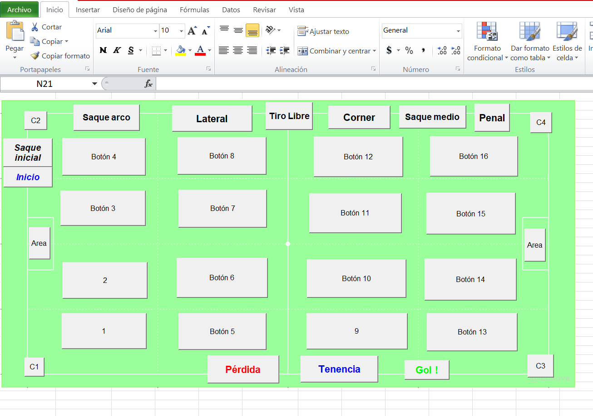

# soccertracckingdata

Overview
--------

    project
    |- doc/            # documentacion del estudio
    |  |- articles/    # related articles, reviews 
    |  +- paper/       # manuscript(s), whether generated or not
    |
    |- data            # raw and primary data, are not changed once created 
    |  |- raw/         # raw data, will not be altered
    |  +- clean/       # cleaned data, will not be altered once created
    |
    |- code/           # any programmatic code
    |
    |- results         # all output from workflows and analyses
    |  +-  figures/     # graphs, likely designated for manuscript figures
    |
    |- scratch/        # temporary files that can be safely deleted or lost
    |
    |- README          # the top level description of content

How to use
----------

To be completed...